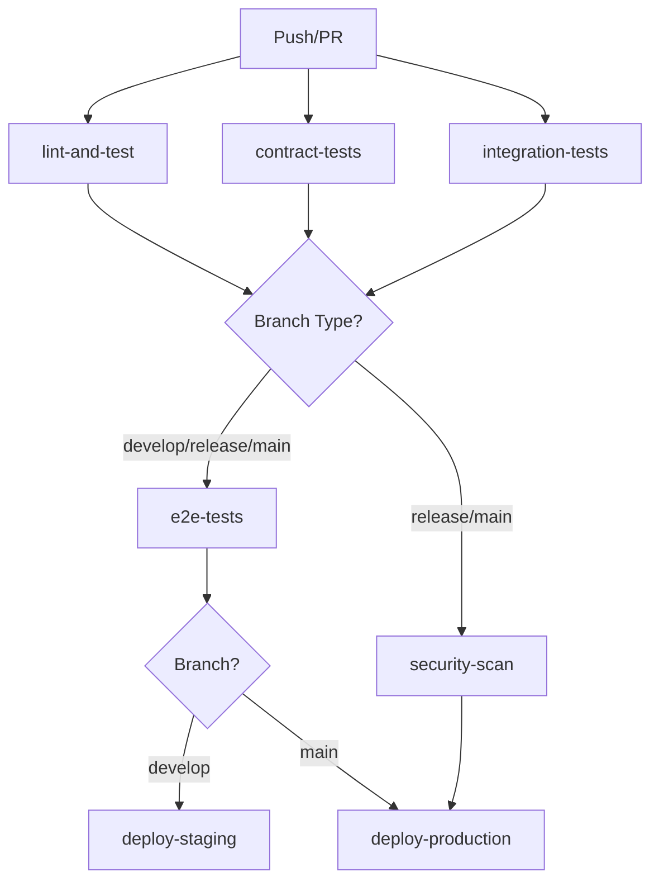

# CI/CD Pipeline Guide

> Comprehensive guide to Bluebird's CI/CD infrastructure, deployment strategies, and DevOps practices.

---

## Overview

Bluebird uses GitHub Actions for CI/CD with a tiered testing strategy aligned to our branching model. Each branch type triggers appropriate checks and deployments.

## Pipeline Architecture

### Branch-Based Testing Tiers

| Branch Type             | Tests Run                                    | Security | Deploy     |
| ----------------------- | -------------------------------------------- | -------- | ---------- |
| `feature/*`, `bugfix/*` | Unit, Integration, Contract, Lint, Typecheck | No       | No         |
| `develop`               | All Basic + E2E                              | No       | Staging    |
| `release/*`             | All Basic + E2E                              | Yes      | No         |
| `main`                  | All + E2E                                    | Yes      | Production |

### Jobs Overview



## Job Definitions

### 1. lint-and-test (Required)

**Purpose**: Fast feedback on code quality and unit tests

**Runs on**: All branches and PRs

**Steps**:

- Type checking (TypeScript)
- Linting (ESLint)
- Unit tests (Vitest)
- Build verification

**Performance targets**:

- Duration: < 5 minutes
- Fail fast on first error
- Cached dependencies

**Services**:

- PostgreSQL 16-alpine
- Redis 7-alpine

### 2. contract-tests (Required)

**Purpose**: Ensure API contracts remain stable

**Runs on**: All branches and PRs

**Steps**:

- Build types package
- Check OpenAPI schema diff
- Fail if schema changed without version bump

**Performance targets**:

- Duration: < 3 minutes
- No breaking changes allowed on feature branches

### 3. integration-tests (Required)

**Purpose**: Test service interactions and workflows

**Runs on**: All branches and PRs

**Steps**:

- Run integration test suite with Testcontainers
- Test DB migrations, queue workers, S3 operations
- Validate SSE event flows

**Performance targets**:

- Duration: < 10 minutes
- Isolated test environment per run

**Services**:

- PostgreSQL 16-alpine
- Redis 7-alpine
- (Future: MinIO for S3 testing)

### 4. e2e-tests (Conditional)

**Purpose**: Validate end-to-end user flows

**Runs on**: `develop`, `release/*`, `main` only

**Steps**:

- Install Playwright browsers
- Run E2E test suite
- Upload test artifacts

**Performance targets**:

- Duration: < 15 minutes
- Test critical user journeys
- Screenshot/video on failure

**Why conditional?**

- E2E tests are expensive (time + resources)
- Feature branches get fast feedback from unit/integration
- Full E2E validation happens before staging deployment

### 5. security-scan (Conditional)

**Purpose**: Identify security vulnerabilities before release

**Runs on**: `release/*`, `main` only

**Steps**:

- npm audit (moderate level)
- Snyk security scan (high severity threshold)
- Generate security report

**Performance targets**:

- Duration: < 5 minutes
- Continue on non-critical issues
- Block on high-severity vulnerabilities

**Configuration**:

- Requires `SNYK_TOKEN` secret (optional)
- Scans dependencies and container images

### 6. deploy-staging (Conditional)

**Purpose**: Deploy to staging environment for testing

**Runs on**: `develop` branch pushes only

**Steps**:

1. Build application (production mode)
2. Set build metadata (SHA, timestamp, version)
3. Build Docker images (when Dockerfiles ready)
4. Push to container registry
5. Deploy to staging infrastructure
6. Run smoke tests
7. Generate deployment summary

**Performance targets**:

- Duration: < 10 minutes
- Zero-downtime deployment
- Auto-rollback on smoke test failure

**Metadata captured**:

- Git SHA (short)
- Build timestamp (UTC)
- Version: `0.X.0-staging.{RUN_NUMBER}`

### 7. deploy-production (Conditional)

**Purpose**: Deploy to production environment

**Runs on**: `main` branch pushes only

**Requires**: All other jobs to pass

**Steps**:

1. Build application (production mode)
2. Set build metadata + extract release notes
3. Build Docker images
4. Tag with version (if tagged release)
5. Deploy to production (blue-green/canary)
6. Run production smoke tests
7. Generate deployment summary

**Performance targets**:

- Duration: < 15 minutes
- Progressive rollout (canary: 10% → 50% → 100%)
- Auto-rollback on health check failures

**Metadata captured**:

- Git SHA (short)
- Build timestamp (UTC)
- Version from package.json
- Release tag (if applicable)
- Release notes from `docs/releases/`

---

## Deployment Strategies

### Staging Deployment (Develop)

**Strategy**: Replace deployment

**Process**:

1. Build new version
2. Run database migrations (if any)
3. Replace running containers
4. Health check
5. Smoke tests

**Rollback**: Redeploy previous version if smoke tests fail

**Monitoring**: Real-time logs, error rates, response times

### Production Deployment (Main)

**Strategy**: Blue-Green with Canary rollout (future)

**Current (Sprint 0-1)**: Simple replacement
**Future (Sprint 2+)**: Progressive canary deployment

**Canary Process**:

1. Deploy to 10% of instances
2. Monitor for 5 minutes
3. If healthy, increase to 50%
4. Monitor for 10 minutes
5. If healthy, complete rollout to 100%
6. Monitor for 30 minutes

**Rollback Triggers**:

- Error rate > 1%
- Response time P95 > 2x baseline
- Health check failures
- Manual rollback command

**Health Checks**:

- `/health` endpoint (200 OK)
- Database connectivity
- Redis connectivity
- Queue worker responsiveness

---

## Environment Configuration

### Staging Environment

**Infrastructure**:

- URL: `https://staging.bluebird.app`
- Deployment: Auto on `develop` push
- Database: Dedicated staging DB (refreshed weekly)
- Redis: Dedicated instance
- S3: Staging bucket (lifecycle: 7 days)

**Purpose**:

- Integration testing
- QA validation
- Demo environment
- Sprint preview

**Data**:

- Synthetic test data
- No production data
- Refreshed from seed scripts

### Production Environment

**Infrastructure**:

- URL: `https://bluebird.app`
- Deployment: Auto on `main` push (after manual approval)
- Database: Production DB (automated backups)
- Redis: Production cluster
- S3: Production bucket (lifecycle policies)

**Purpose**:

- Serve live users
- Generate real business value
- Performance monitoring
- Revenue tracking

**Data**:

- Real user data
- GDPR compliance
- Backup retention: 30 days
- Point-in-time recovery

---

## Secrets Management

### Required Secrets

**Repository Secrets** (GitHub Settings → Secrets):

| Secret                  | Purpose                  | Required For     |
| ----------------------- | ------------------------ | ---------------- |
| `SNYK_TOKEN`            | Security scanning        | release/\*, main |
| `STAGING_DEPLOY_KEY`    | Staging deployment       | develop          |
| `PROD_DEPLOY_KEY`       | Production deployment    | main             |
| `DOCKER_REGISTRY_TOKEN` | Push images              | develop, main    |
| `SLACK_WEBHOOK_URL`     | Deployment notifications | develop, main    |

**Environment Secrets** (Per environment):

**Staging**:

- `DATABASE_URL`
- `REDIS_URL`
- `S3_ACCESS_KEY`
- `S3_SECRET_KEY`
- `JWT_SECRET`
- `SMTP_URL`

**Production**:

- `DATABASE_URL`
- `REDIS_URL`
- `S3_ACCESS_KEY`
- `S3_SECRET_KEY`
- `JWT_SECRET`
- `SMTP_URL`
- `OTEL_EXPORTER_OTLP_ENDPOINT`

---

## Performance Optimization

### Caching Strategy

**pnpm Store Cache**:

- Key: `${{ runner.os }}-pnpm-store-${{ hashFiles('**/pnpm-lock.yaml') }}`
- Restores from: Previous pnpm store caches
- Invalidates: When pnpm-lock.yaml changes

**Docker Layer Cache** (future):

- Multi-stage builds
- Layer caching in registry
- Cache mount for dependencies

**Playwright Browsers** (future):

- Cache installed browsers
- Reuse across runs

### Parallel Execution

**Current**:

- `lint-and-test`, `contract-tests`, `integration-tests` run in parallel
- Independent jobs with no dependencies

**Future Optimizations**:

- Matrix builds for different Node versions
- Shard E2E tests across runners
- Parallel deployment zones

---

## Monitoring & Observability

### CI/CD Metrics

**Track**:

- Pipeline success rate (target: > 95%)
- Mean time to feedback (target: < 5 min)
- Deployment frequency (target: > 10/day on develop)
- Lead time (commit to production: target < 2 hours)
- Change failure rate (target: < 5%)
- MTTR (mean time to recovery: target < 30 min)

**Dashboard** (GitHub Insights):

- View workflow runs
- Track success/failure trends
- Monitor duration over time

### Deployment Tracking

**Metadata in Deployments**:

- Git SHA (full and short)
- Build timestamp
- Version number
- Release notes link
- Deployer (GitHub user)
- Environment

**Deployment Summary** (GitHub Actions Summary):

- Environment deployed to
- Version/tag information
- Build metadata
- Links to URLs
- Test results summary

---

## Troubleshooting

### Common Issues

**1. E2E Tests Fail on develop**

**Cause**: Test environment issues or flaky tests

**Solutions**:

- Check if E2E test suite exists (`pnpm run test:e2e`)
- Verify Playwright browsers installed
- Check service health (PostgreSQL, Redis)
- Review test logs in uploaded artifacts

**2. Security Scan Blocks Release**

**Cause**: High-severity vulnerabilities detected

**Solutions**:

- Review `pnpm audit` output
- Update vulnerable dependencies
- Check Snyk dashboard for details
- Apply patches or mitigations
- Document accepted risks

**3. Deployment Fails Smoke Tests**

**Cause**: Application not healthy after deployment

**Solutions**:

- Check deployment logs
- Verify health endpoints
- Check database migrations
- Review environment variables
- Manual rollback if needed

**4. Contract Tests Fail**

**Cause**: API schema changed without version bump

**Solutions**:

- Review OpenAPI schema changes
- Update API version if breaking
- Document changes in changelog
- Ensure backward compatibility

### Debug Mode

**Enable verbose logging**:

Add to workflow file:

```yaml
- name: Debug
  run: |
    echo "::debug::Debugging information"
    set -x  # Enable bash debug mode
```

**Re-run with debug logging**:

- GitHub Actions → Failed run → Re-run jobs with debug logging

---

## Future Enhancements

### Sprint 2+

**Docker Integration**:

- [ ] Create Dockerfiles for api and web
- [ ] Multi-stage builds for optimization
- [ ] Layer caching in CI
- [ ] Image scanning with Trivy

**Advanced Deployments**:

- [ ] Implement canary deployments
- [ ] Blue-green deployment strategy
- [ ] Feature flags for gradual rollout
- [ ] A/B testing infrastructure

**Monitoring**:

- [ ] Integrate OpenTelemetry
- [ ] Deployment markers in Grafana
- [ ] Error tracking (Sentry)
- [ ] Performance monitoring (Lighthouse CI)

**Testing**:

- [ ] Visual regression testing
- [ ] Load testing in staging
- [ ] Chaos engineering
- [ ] Contract testing with Pact

**Automation**:

- [ ] Auto-merge dependabot PRs
- [ ] Automated changelog generation
- [ ] Release notes from commits
- [ ] Slack/Discord notifications

---

## Best Practices

### For Developers

1. **Run tests locally before pushing**

   ```bash
   pnpm run check  # lint + typecheck + format check
   pnpm run test   # unit tests
   ```

2. **Keep PRs small and focused**
   - Easier to review
   - Faster CI runs
   - Lower failure rate

3. **Write good commit messages**
   - Follow conventional commits
   - See § 13 in copilot-instructions.md

4. **Monitor your PR builds**
   - Fix failures quickly
   - Don't merge on red builds

### For DevOps

1. **Keep pipelines fast**
   - Target < 10 minutes for feedback
   - Use caching aggressively
   - Parallelize when possible

2. **Make failures obvious**
   - Clear error messages
   - Upload artifacts on failure
   - Provide remediation steps

3. **Secure by default**
   - Secrets in GitHub Secrets
   - Minimal permissions
   - Audit access regularly

4. **Document everything**
   - Pipeline changes
   - Deployment procedures
   - Rollback steps
   - Incident playbooks

---

## Related Documentation

- [Branching Strategy](BRANCHING_STRATEGY.md)
- [Commit Message Standards](.github/copilot-instructions.md#13-commit-message-standards)
- [Testing Strategy](../apps/api/TESTING.md)
- [Sprint Planning](../project/sprints/)

---

## Status

- **Active**: CI/CD pipeline operational as of Sprint 1
- **Review**: Pipeline performance reviewed each sprint
- **Updates**: Document updates via PR to develop
