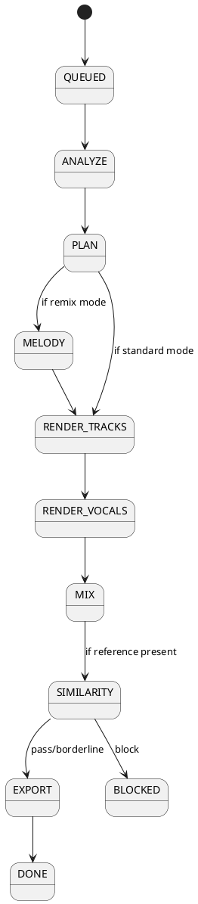
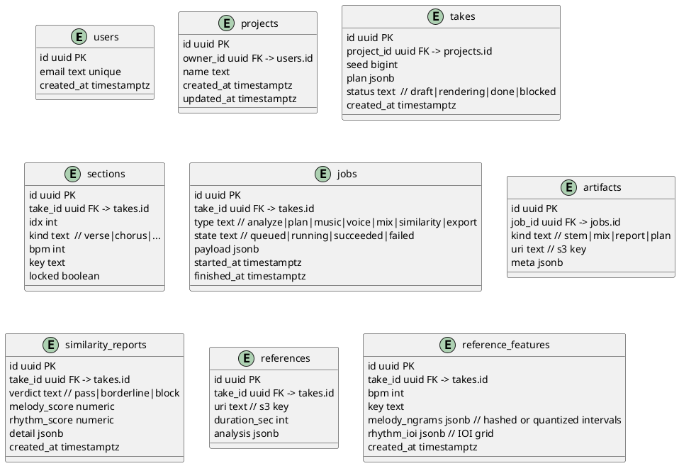

# SPEC-001-Bluebird — Method (Standalone)

## Method

### Reference Architecture (MVP)

```plantuml
@startuml
skinparam componentStyle rectangle
skinparam wrapWidth 200


package "Client" {
[Next.js Frontend]
[Local WebAudio Preview]
}


package "Backend" {
[Orchestrator API (Fastify)] as Orchestrator
[Queue (Redis/BullMQ)\nqueues: plan, analyze, melody, synth, vocal, mix, check, export\npriorities: pro, standard] as Queue
[Job Worker (Node/TS)] as Worker
}


package "Inference Pods (Python)" {
[Analyzer]
[Planner]
[Melody Generator (Remix)] as Melody
[Music Synth] as Music
[Voice Synth] as Voice
[Similarity Checker] as Similarity
[Mix & Master] as Mix
[Exporter]
}


package "Data Stores" {
database "PostgreSQL" as PG
[Object Storage (S3‑compatible)] as S3
[Redis]
[CDN]
}


package "Observability" {
[OpenTelemetry Traces/Metrics]
[Log Sink]
}


"Next.js Frontend" --> Orchestrator : HTTPS JSON
"Next.js Frontend" <-down-> Orchestrator : **SSE /jobs/:id/events**
"Local WebAudio Preview" <-[dotted]-> S3 : presigned GET (short TTL)
Orchestrator <--> Redis : enqueue/dequeue (named queues; priority)
Orchestrator <--> PG : CRUD + job states
Orchestrator <--> S3 : signed URLs
S3 <--> CDN : edge cache
Worker <--> Redis : consume/produce
Worker --> Analyzer
Worker --> Planner
Worker --> Melody
Worker --> Music
Worker --> Voice
Worker --> Similarity
Worker --> Mix
Worker --> Exporter
Analyzer --> S3
Planner --> S3
Melody --> S3
Music --> S3
Voice --> S3
Mix --> S3
Exporter --> S3
All Pods --> PG : status, artifacts
@enduml
```

### Rationale

- **Separation of concerns**: Orchestrator coordinates; pods are stateless functional stages; Redis queue enables back‑pressure.
- **Reproducibility**: Every stage writes artifacts, seeds, and reports to S3 and rows to PG; jobs are resumable.
- **Scalability**: Horizontal autoscaling per‑pod based on queue depth and GPU/CPU minutes.

### Key Services & Responsibilities

- **Orchestrator API (Node+TS)**: Auth, input validation, plan/build job DAGs, issue signed URLs, expose `/plan/*`, `/render/*`, `/remix/*`, `/check/similarity`, `/mix/final`, `/export`.
- **Analyzer (Python)**: Lyrics parse (syllables, rhyme hints), optional reference analysis (BPM/key/sections), melody/rhythm extraction for similarity engine.
- **Planner**: Builds arrangement/structure from lyrics + genre preset (BPM/key/instrumentation per section) and seeds the generation plan.
- **Music Synth (GPU)**: Generates backing tracks by section with fixed seed; emits stems.
- **Voice Synth (GPU)**: Renders lead vocal (selected AI artist) + optional harmonies; aligns to section timing.
- **Similarity Checker (CPU/GPU)**: Computes melodic/rhythmic similarity against private reference; produces a report and a pass/borderline/block verdict.
- **Mix & Master**: Sum stems; apply era preset; constrain loudness; export master.
- **Exporter**: Packages BWF markers, embeds BPM/key, aligns stems; blocks export if similarity verdict=block.

### API Surface (selected endpoints & contracts)

`POST /plan/song`

```json
{
  "lyrics": "string",
  "genrePreset": "pop_2010s|trap|folk|indie_rock|...",
  "bpm": null,
  "key": null,
  "structure": ["intro", "verse", "chorus", "verse", "chorus", "bridge", "chorus", "outro"],
  "artist": "id",
  "options": { "harmonies": true, "duet": false }
}
```

**Response**: `{ "planId": "uuid", "sections": [...], "seed": 123456 }`

`POST /render/preview`

```json
{ "planId": "uuid", "durationSec": 30 }
```

**Response**: `{ "jobId": "uuid" }`

`POST /render/section`

```json
{ "planId": "uuid", "sectionId": "uuid", "regen": true }
```

`POST /remix/reference/upload`

```json
{ "planId": "uuid", "referenceUrl": "s3://...", "durationSec": 26 }
```

`POST /check/similarity`

```json
{ "planId": "uuid" }
```

**Response** (excerpt):

```json
{
  "verdict": "pass|borderline|block",
  "melodyScore": 0.31,
  "rhythmScore": 0.22,
  "excerpts": [{ "start": 12.3, "end": 16.7, "why": "interval-5gram overlap 0.61" }],
  "recommendations": ["shift key +1", "change BPM -3", "regen chorus topline"]
}
```

`POST /export`

```json
{ "planId": "uuid", "includeStems": true, "format": ["wav24", "mp3_320"], "includeMarkers": true }
```

**Response**: presigned download URLs or 409 with similarity report if blocked.

`GET /jobs/:jobId/events`

```json
{ "jobId": "uuid", "stage": "MIX", "progress": 0.73, "etaSec": 22, "runId": "..." }
```

`POST /plan/song (alias for clarity)`

```json
{ "planId": "uuid", "strategy": "contour_guided|fresh", "similarityBudget": 0.35 }
```

**Response**:

```json
{ "melodyId": "uuid", "features": {"intervalNgrams": [...], "ioi": [...] } }
```

`POST /plan/arrangement and POST /plan/vocals`
(aliases of POST /plan/song for clarity)

**Idempotency**: All POSTs accept header Idempotency-Key (UUIDv4). Duplicate keys return first success response.

### Job Orchestration & State Machine



### Data Model (PostgreSQL)



**Note**:

- References table remains for optional raw audio if user opts in; policy defaults to storing only reference_features.
- Add indexes: reference_features(take_id), reference_features(created_at).

### Indexes & Retention

- `jobs(take_id, state)`; `artifacts(job_id)`; `sections(take_id, idx)`; `similarity_reports(take_id, created_at desc)`.
- Retain raw intermediates 30 days (configurable); keep plans/reports indefinitely unless user deletes project.

### Object Storage Layout (S3)

```text
projects/{projectId}/takes/{takeId}/
  plan.json
  sections/{idx}/
    music/{stem}.wav
    vocals/{part}.wav
  mix/master.wav
  mix/master.mp3
  reports/similarity-{timestamp}.json
  reference/ref.wav
```

### Similarity Check (export gate)

**Purpose**: Encourage originality; allow _vibe_ without cloning. Operates on **melody** and **rhythm** only (no timbre).
**Similarity Budget (Pro)**: target combined score threshold (e.g., 0.35 default; tighter for Free). UI shows remaining budget.

#### Pipeline

1. **Prep**: If provided, run vocal separation on reference (or HPSS). Normalize loudness; detect BPM/key.
2. **Pitch track** (both reference and candidate): frame 20ms, hop 10ms; convert to cents; fill unvoiced gaps by linear interpolation ≤150ms.
3. **Melodic signature**: build **interval n‑grams** (n=3..5) from semitone deltas; quantize to ±0.5 semitone.
4. **Rhythmic signature**: compute inter‑onset intervals (IOI) from onset detection; quantize to a 16th‑note grid aligned to detected BPM; also compute duration ratios per note.
5. **Scores**:
   - Melody: `Jaccard(ngrams_ref, ngrams_cand)` + **Longest Common Subsequence** (interval stream) normalized.
   - Rhythm: **DTW** on IOI sequences with Sakoe‑Chiba band ±12.5% tempo; penalty for long constant runs.

6. **Combine**: `score = 0.6 * melody + 0.4 * rhythm`.
7. **Verdict**: `pass < 0.35`, `borderline 0.35–0.48`, `block ≥ 0.48`.
8. **Report**: top overlapping excerpts with timestamps + suggested mitigations (transpose, BPM shift, regen affected sections).

#### Hard Rules

- Reference limited to ≤30s; stored private; never used to train.
- Block if any contiguous 8‑bar segment hits melody LCS ≥ 0.7 and rhythm DTW ≤ 0.15 (high alignment) even if combined < threshold.

### Audio & Mastering

- **Sample formats**: 44.1kHz/24‑bit WAV, 320kbps MP3; stems aligned; BWF cues for sections.
- **Loudness**: target ‑14 LUFS integrated; true‑peak ceiling ‑1.0 dBTP; per‑track headroom −6 dBFS before sum; simple bus comp + limiter per preset.

### Performance & Scaling Plan

- **Preview path**: Analyzer→Planner→(Music/Voice limited to first 30s)→Mix; pods min=1 warm, scale to 5; target ≤45s P50.
- **Section regen**: spawn only affected Music/Voice tasks; cached stems unchanged; ≤20s P50.
- **Full render**: pipeline per section, parallel where possible; cap concurrency per project to avoid OOM.

### Security & Compliance

- Private S3 buckets; time‑boxed presigned URLs.
- Redis + TLS; disable dangerous commands; Redis users/ACLs with least privilege.
- Limit uploads to 30s; hash references; audit logs for uploads/exports; simple profanity filter on lyrics & titles.
- Export gate enforced server‑side only.

### Local Dev & IDE/Agent Workflow

- **CLI** (`bluebird`): `bluebird plan`, `bluebird preview`, `bluebird render --section 3`, `bluebird check`, `bluebird export`.
- **VS Code extension**: commands mirror CLI; surface job timeline; open artifacts; one‑click bug report with run‑IDs and seeds.
- **Agent hooks**: curated system prompts for ChatGPT/Claude “Render Planner” and “Similarity Analyst”; write‑protected to keep outputs deterministic.

### Technology Selections (implementation-ready)

- **Frontend**: Next.js (App Router), React 19, TypeScript (strict), Tailwind.
- **Backend**: Node.js LTS, Fastify (JSON schema validation), Zod for DTOs, tRPC or REST + OpenAPI.
- **Jobs**: BullMQ + Redis; rate limits per user; dead‑letter queue.
- **Data**: PostgreSQL; Prisma ORM; drizzle for lightweight SQL (optional) if preferred.
- **Inference**: Python 3.x, PyTorch + torchaudio; FFmpeg for encoding/muxing.
- **Observability**: OpenTelemetry (traces, metrics), Prometheus, Grafana; Sentry for errors.
- **Infra**: Serverless GPU/CPU pods; object storage (S3 or compatible); IaC with Terraform.

#### Implementation Notes (affected areas)

- **Frontend**: add SSE client + Local WebAudio mixer; A/B compare; budget slider (Pro).
- **Orchestrator**: implement SSE, idempotency keys, queue naming, priority scheduling.
- **New pod**: Melody Generator with guide outputs (features + optional midi/pitch track).
- **Data**: migrate to reference_features table; add backfill job for existing takes.
- **DevOps**: add CDN distribution; update IaC; add SSE scaling rules.
